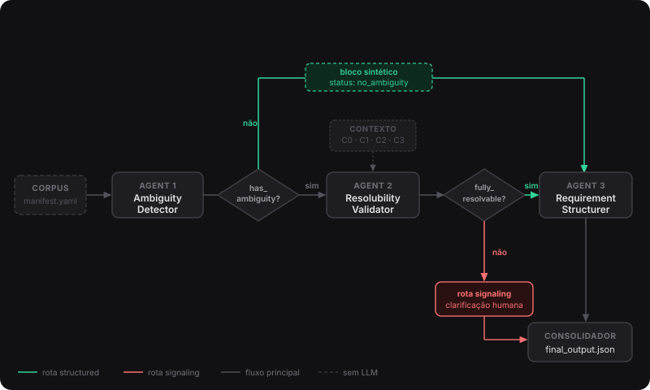

# Material e Métodos

## Delineamento da pesquisa

Esta pesquisa foi classificada como de natureza aplicada, com abordagem quantitativa e objetivo explicativo (Gil, 2018): buscou identificar o efeito do nível e da relevância do contexto fornecido a um "pipeline" multi-agente sobre a resolução de ambiguidades em requisitos de software, isto é, sobre a rota de resolução adotada pelo "pipeline". Complementarmente, descreveu o desempenho do "pipeline" na detecção e na classificação de tipo das ambiguidades, etapas que independem do contexto e foram avaliadas na condição sem contexto (C0). O delineamento adotado foi o experimental (Kerlinger, 1980), com manipulação direta da variável independente — condição de contexto — e mensuração das variáveis dependentes em condições controladas. A técnica de coleta de dados adotada foi a pesquisa documental (Gil, 2018): os requisitos que compuseram o corpus foram extraídos de publicações científicas e tratados como dados do estudo — os próprios textos dos requisitos, e não as análises dos autores das fontes —, sem coleta primária junto a participantes humanos.

O objeto de estudo foi o "pipeline" multi-agente de detecção e resolução de ambiguidades, implementado pelo autor e aplicado a um corpus controlado de 15 requisitos. O instrumento de coleta de dados foi o próprio "pipeline", que registrou, a cada execução, um artefato de saída (`final_output.json`), posteriormente consolidado em métricas pelo script `evaluate.py`. Não houve trabalho de campo: a pesquisa foi conduzida pelo autor em ambiente computacional local, descrito na subseção Modelos e parâmetros de execução. O primeiro registro de desenvolvimento no repositório do estudo data de 30 de maio de 2026; a execução-piloto ocorreu em 29 de julho e o experimento principal, em 22 e 23 de setembro de 2026. Por não envolver participantes humanos nem dados pessoais, e por utilizar apenas textos de publicações científicas de acesso público, a pesquisa não foi submetida a Comitê de Ética em Pesquisa (Brasil, 2016).

Os sujeitos do experimento foram os requisitos, e a população de referência foi o conjunto de requisitos de software escritos em linguagem natural em inglês. Como a seleção dos 15 requisitos foi intencional (subseção Corpus controlado), e não aleatória, os resultados não podem ser generalizados estatisticamente a toda essa população. Por outro lado, cada requisito foi submetido a todas as condições de contexto, de modo que serve de controle de si mesmo e as comparações entre condições são pareadas por requisito. Nesse desenho, a randomização da alocação às condições é dispensável, pois não há grupos distintos cujas características pudessem confundir os resultados. As execuções são independentes entre si, já que cada chamada ao modelo é enviada sem o histórico das anteriores.

## Perguntas de pesquisa, hipóteses e operacionalização das variáveis

### Perguntas de pesquisa e hipóteses

Formularam-se três perguntas de pesquisa que orientaram o delineamento experimental. Os termos relativos ao corpus (categorias Cat-01 a Cat-05 e condições de contexto C0 a C3), ao "pipeline" (agentes e rotas de resolução) e à avaliação (métricas e blocos) são detalhados, respectivamente, nas subseções Corpus controlado, Arquitetura do pipeline e Protocolo de avaliação.

**RQ1:** A relevância semântica do contexto injetado — mantida a especificidade constante entre as condições C2 (contexto relevante) e C3 (contexto irrelevante) — altera a rota de resolução adotada pelo "pipeline"?

**RQ2:** O "pipeline" distingue requisitos ambíguos de bem formados sem gerar falsos positivos, mantendo precisão, revocação, F1 e especificidade adequadas sobre um grupo de controle intencionalmente construído sem defeitos?

**RQ3:** Entre as categorias de ambiguidade — linguística, de domínio e de vaguidade —, quais apresentam maior dificuldade de classificação de tipo pelo "pipeline", segundo a taxonomia de Pohl (2025)? A categoria estrutural (Cat-01) integra a detecção (RQ2), mas não a análise de tipo, pois seus defeitos não constituem tipos dessa taxonomia.

A partir dessas perguntas, foram enunciadas três hipóteses experimentais.

**H1:** Se o contexto injetado for semanticamente relevante para o fragmento ambíguo (condição C2), então a taxa de conversão de rota `signaling→structured` será significativamente superior à observada quando o contexto for específico, porém irrelevante (condição C3), segundo teste exato binomial unilateral sobre os pares discordantes de cada modelo (α = 0,05).

**H2:** Se o "pipeline" operar sobre o corpus controlado, então a precisão, a revocação e o F1 serão superiores a 0,70 nas execuções em C0, e a taxa de falsos positivos sobre Cat-05 será inferior a 0,30.

**H3:** Se as categorias de defeito diferirem em complexidade linguística e dependência de domínio, então Cat-03 (domínio) e Cat-04 (vaguidade) apresentarão menor taxa de acerto de tipo do que Cat-02 (linguística), na condição C0.

Os limiares de H2 foram fixados antes da execução do experimento principal — registrados no repositório do estudo em 21 de setembro de 2026 (Andrade, 2026), um dia antes das execuções — como critério do pesquisador, e não como padrão normativo, dada a inexistência de valor de referência consolidado para a tarefa. O valor de 0,70 situou-se na faixa de desempenho reportada por estudos anteriores: Bashir et al. (2025) obtiveram F1 de até 75,8% na detecção de ambiguidade em requisitos industriais com modelos de código aberto, e Nair e Anish (2025) reportaram revocação macro-média máxima de 0,75, obtida pelo GPT-4o-mini, modelo proprietário. O limiar de 0,30 para falsos positivos corresponde ao complemento de uma especificidade de 0,70, mantendo a simetria com os demais critérios.

### Operacionalização das variáveis

A variável independente (VI) correspondeu à condição de contexto experimental, operacionalizada em quatro níveis mutuamente exclusivos: C0 (sem contexto), C1 (domínio do sistema e glossário periférico), C2 (C1 acrescido de conteúdo diretamente relevante ao fragmento ambíguo) e C3 (C1 acrescido de conteúdo específico sobre aspecto distinto do fragmento ambíguo). A VI foi manipulada pelo pesquisador por meio da construção controlada do campo `context` em cada instância experimental do corpus.

Três variáveis dependentes foram mensuradas. A primeira (VD1) correspondeu à rota do "pipeline" — categórica binária: `structured` ou `signaling` —, derivada automaticamente do campo `pipeline_decision.route` do artefato `final_output.json`. A segunda (VD2) compreendeu as métricas de detecção — precisão, revocação, F1 e especificidade —, calculadas pelo script `evaluate.py` a partir das classificações TP, FP, FN e TN de cada execução em C0. A terceira (VD3) registrou o acerto de tipo de ambiguidade — variável binária por instância —, verificada pela presença de ao menos um dos tipos detectados pelo Agente 1 entre os tipos aceitos declarados no corpus (`taxonomy_accepted_types`), nas execuções em C0 de Cat-02, Cat-03 e Cat-04.

As variáveis controladas incluíram o texto do requisito (fixo por instância em todas as condições), a temperatura dos modelos (0,0 em todos os casos), o parâmetro `think: false` e o esquema YAML dos "prompts" de sistema. Os sete modelos avaliados foram tratados como fator de comparação, e não como variável controlada: suas diferenças arquiteturais, de tamanho e de treinamento não foram isoladas e limitam a atribuição de diferenças de desempenho a características específicas dos modelos. Reconhecem-se ainda como limitações do estudo: o não-determinismo residual das saídas, pois a temperatura 0,0 não garante determinismo bit a bit em execução por GPU; o tamanho reduzido do corpus, com três requisitos por categoria; o idioma único dos requisitos; a elaboração do gabarito por um único anotador, sem medida formal de concordância; e a falha de conversão de três execuções do qwen3.5:9b, descrita na seção de Resultados e Discussão.

## Corpus controlado

Para assegurar reprodutibilidade, foi construído um corpus de 15 requisitos em linguagem natural, todos com fonte identificada na literatura e selecionados intencionalmente pelo autor, precedido por uma execução-piloto com seis requisitos construídos pelo autor.

### Execução-piloto

A execução-piloto foi realizada em julho de 2026, com o qwen3.5:9b, sobre seis requisitos construídos pelo autor — um por tipo de defeito —, de modo a exercitar cada categoria antes da definição do corpus final: um requisito estrutural, com ação funcional e critério de qualidade reunidos na mesma sentença; um de ambiguidade referencial, com pronome de dois antecedentes; um de vaguidade, com critério de elegibilidade impreciso; um lexical, com termo polissêmico; um semântico, com precedência ambígua entre os operadores "e" e "ou"; e um de controle, sem ambiguidade. O piloto não integrou a avaliação experimental. Seus resultados orientaram o ajuste dos "prompts" dos agentes (descritos na subseção Arquitetura do pipeline) e a definição das categorias de defeito adotadas no corpus final.

### Taxonomia de ambiguidades

A classificação das ambiguidades adotou a taxonomia de Pohl (2025), que distingue cinco tipos: **(1) lexical**, quando um termo admite múltiplos significados e o contexto não permite discriminar qual se aplica; **(2) sintática**, quando a estrutura gramatical da sentença admite mais de uma árvore de análise com interpretações distintas; **(3) semântica**, quando operadores lógicos ou relacionais — como "e", "ou", "se" — não delimitam com precisão as condições a que se aplicam; **(4) referencial**, quando um pronome, anáfora ou expressão nominal possui mais de um antecedente plausível; e **(5) vaguidade**, quando predicados, quantificadores ou termos de fronteira impedem a verificação objetiva do critério enunciado. Essa taxonomia foi adotada tanto na construção do gabarito do corpus quanto nos "prompts" do Agente 1, de modo que os tipos detectados pelo "pipeline" fossem comparáveis aos tipos aceitos declarados manualmente.

### Categorias do corpus

Os 15 requisitos foram distribuídos em cinco categorias: **(Cat-01) estrutural**, com requisitos que apresentavam defeitos de formação — não-factibilidade, não-atomicidade e incompletude —, referenciados na taxonomia de *requirement smells* de Veizaga et al. (2024) e nos critérios de qualidade de Pohl (2025); **(Cat-02) linguística**, com ambiguidades sintáticas, referenciais e semânticas (de operadores lógicos), independentes de conhecimento de domínio; **(Cat-03) de domínio**, com ambiguidades lexicais e semânticas cuja resolução dependia de conhecimento especializado ou de definições operacionais ausentes; **(Cat-04) de vaguidade**, com requisitos que empregavam quantificadores, termos de fronteira ou predicados temporais imprecisos (Pohl, 2025); e **(Cat-05) de controle**, com requisitos intencionalmente bem formados e sem defeitos esperados. Os três requisitos dessa categoria constituíram o grupo de controle negativo do experimento: foram selecionados da literatura por não apresentarem ambiguidades ou defeitos estruturais, com o propósito de mensurar a taxa de falsos positivos do Agente 1. A função do grupo de controle consistiu em verificar se o "pipeline" produzia alertas de ambiguidade na ausência de defeitos reais — condição necessária para interpretar os resultados das demais categorias. Como limitação de desenho, os três requisitos de Cat-05 representaram 20% do corpus e foram escolhidos intencionalmente pelo autor, não por amostragem aleatória; esse fato foi considerado na interpretação dos índices de falsos positivos reportados na seção de Resultados e Discussão.

### Seleção dos requisitos

Os requisitos do corpus final foram selecionados de forma intencional pelo autor, a partir de exemplos publicados na literatura (Pohl, 2025; Veizaga et al., 2024; Kamsties et al., 2001; Bashir et al., 2025; Unterbusch e Vogelsang, 2026; Vogelsang et al., 2025), e não por amostragem aleatória. A seleção foi revisada pelo professor orientador. Cada requisito mantém a citação de origem, o que permite rastrear o defeito esperado até a fonte. Adotaram-se três requisitos por categoria, o que resultou em um desenho balanceado de 15 textos-base. Esse tamanho também respondeu a uma restrição prática: o experimento foi executado em um único equipamento de uso individual — um MacBook Pro com chip Apple M5 e 16 GB de memória RAM —, e o tempo de execução cresce proporcionalmente ao número de requisitos. Cada requisito adicional acrescentaria sete execuções em C0 (uma por modelo) e, se o Agente 1 detectasse ambiguidade, outras 21 em C1, C2 e C3 (sete modelos × três condições). Em caso de falha, a execução precisaria ser refeita, ampliando ainda mais o tempo total. Manteve-se, assim, um corpus enxuto.

### Condições de contexto

Cada requisito foi avaliado sob quatro condições de contexto: C0 (sem contexto); C1 (domínio do sistema e glossário de termos periféricos, excluindo o fragmento ambíguo); C2 (acumula C1 e adiciona conteúdo que endereça diretamente o fragmento ambíguo, na forma de definição operacional, regra de negócio ou restrição); e C3 (acumula C1 e adiciona conteúdo específico sobre um aspecto diferente do requisito, nunca o fragmento ambíguo). O delineamento foi de um único fator — a condição de contexto — com quatro níveis (Wohlin et al., 2012), e não um plano fatorial completo: os níveis C1, C2 e C3 diferem em especificidade (baixa ou alta) e em relevância (irrelevante ou relevante) do contexto injetado, mas a combinação de baixa especificidade com relevância não foi construída. Contrastes planejados, pareados por requisito, isolam cada efeito: C2 vs. C3 isola o efeito da relevância com especificidade constante (alta); C3 vs. C1, o da especificidade com relevância constante (nula); e C1 vs. C0, o do contexto genérico. C0 é executado para todos os requisitos; C1, C2 e C3, apenas quando o Agente 1 detecta ambiguidade em C0.

Com 15 textos-base e quatro condições, o corpus totalizou 60 instâncias experimentais possíveis (15 × 4), das quais apenas as 15 de C0 são executadas incondicionalmente. Como a saída do Agente 1 é independente do contexto e reutilizada nas quatro condições, C1, C2 e C3 são executadas para um requisito somente se o Agente 1 detectar ambiguidade em C0 — o que vale também para os requisitos de Cat-05, nos quais uma detecção constitui falso positivo, mas ainda assim aciona as condições seguintes; a não detecção, por sua vez, dispensa as três (três instâncias a menos). Sobre os sete modelos avaliados (apresentados na subseção Modelos e parâmetros de execução), o teto do experimento foi de 420 execuções (60 instâncias × 7 modelos); o número efetivo depende dos requisitos detectados por cada modelo e é reportado na seção de Resultados e Discussão. A distinção entre texto-base — o requisito selecionado para o corpus — e instância experimental — a combinação entre requisito e condição de contexto — evita ambiguidade metodológica ao reportar os resultados. O corpus é descrito no Apêndice A e está disponível em Andrade (2026).

### Gabarito de avaliação

Para os requisitos de Cat-02, Cat-03 e Cat-04, o corpus definiu o campo `taxonomy_accepted_types` — uma lista dos tipos de ambiguidade esperados, elaborada pelo autor segundo a taxonomia de Pohl (2025) e validada pelo professor orientador —, categorias em que a ambiguidade é classificável na taxonomia de Pohl (2025); Cat-01 não o possui, pois seus defeitos de formação — não-factibilidade, não-atomicidade e incompletude — não constituem tipos dessa taxonomia. A elaboração do gabarito por um único anotador, com validação do orientador e sem medida formal de concordância entre avaliadores, constitui limitação do estudo. O gabarito de detecção, por sua vez, derivou da categoria do requisito: Cat-01 a Cat-04 são positivos e Cat-05 constitui o grupo de controle negativo. O tipo detectado pelo Agente 1 foi confrontado com os tipos declarados em `taxonomy_accepted_types` no Bloco 3 do protocolo de avaliação (subseção Protocolo de avaliação), restrito às três categorias que possuem o campo.

### Idioma

Os requisitos foram mantidos no idioma original das fontes, o inglês, para preservar os fenômenos linguísticos analisados — a tradução introduziria ou eliminaria ambiguidades não presentes no texto original. Estudos recentes indicaram que modelos multilíngues apresentaram forte influência do inglês tanto em seus espaços representacionais quanto na naturalidade de suas saídas em outros idiomas (Schut et al., 2025; Guo et al., 2025), e que tarefas traduzidas não capturaram adequadamente nuances do português brasileiro (Almeida et al., 2025). Como delimitação, os resultados deste estudo referiram-se a requisitos em inglês.

## Modelos e parâmetros de execução

Os experimentos foram conduzidos com sete modelos de linguagem de código aberto executados localmente via Ollama (Ollama, 2026): `qwen3.5:4b`, `qwen3.5:9b`, `gemma3:4b`, `mistral:7b`, `llama3.1:8b`, `phi4-mini` e `deepseek-r1:7b`. A execução local eliminou a variabilidade introduzida por atualizações de interface de programação de aplicações [API] e favoreceu a reprodutibilidade do experimento. As execuções do experimento principal ocorreram entre 22 e 23 de setembro de 2026, em um MacBook Pro com chip Apple M5 e 16 GB de memória RAM, sob macOS 27.0, com Ollama na versão 0.21.1. Todos os modelos foram utilizados com a quantização Q4_K_M distribuída pelo Ollama, com janela de contexto (`num_ctx`) de 8.192 tokens e limite de geração (`num_predict`) de 2.500 a 3.000 tokens, conforme o agente. A `seed` não foi fixada explicitamente, dado que, com temperatura 0,0, a amostragem é determinística e a semente não influencia a escolha dos tokens. O ambiente, os parâmetros e as impressões digitais ("digests") dos arquivos dos modelos estão registrados em Andrade (2026). A versão do Ollama e o equipamento foram registrados após a conclusão das execuções, e não por cada execução, o que constitui limitação de rastreabilidade.

Os sete modelos foram selecionados segundo quatro critérios. O primeiro foi a disponibilidade de pesos abertos no repositório do Ollama, o que permitiu a execução local e reprodutível. O segundo foi o porte, entre 3,8 e 9,7 bilhões de parâmetros, compatível com o equipamento disponível para o experimento — um MacBook Pro com chip Apple M5 e 16 GB de memória RAM. O terceiro foi a diversidade de famílias e fornecedores — Qwen, Gemma, Mistral, Llama, Phi e DeepSeek —, para reduzir o risco de que os achados refletissem idiossincrasias de uma única arquitetura ou base de treinamento. O quarto foi a variação intencional de porte e de modo de raciocínio: dois tamanhos da mesma família (`qwen3.5:4b` e `qwen3.5:9b`) permitiram observar o efeito de escala com a arquitetura constante, e a inclusão de modelos com raciocínio interno (`qwen3.5` e `deepseek-r1:7b`) ao lado de modelos sem esse recurso permitiu comparar os dois perfis sob o mesmo protocolo.

Para minimizar a variabilidade das respostas, todos os modelos foram configurados com temperatura 0,0, o que eliminou a amostragem estocástica e produziu a sequência de tokens de maior probabilidade a cada passo. Essa configuração reduz, mas não elimina o não-determinismo residual — decorrente, por exemplo, de técnicas de eficiência computacional e de aritmética de ponto flutuante — que estudos empíricos observaram mesmo em configurações ditas determinísticas (Ouyang et al., 2024; Atil et al., 2024). Por isso, a reprodutibilidade foi tratada como reprodutibilidade de configuração, e não como identidade bit a bit das saídas. Adicionalmente, o parâmetro `think` foi definido como `false` e enviado a todos os modelos via interface REST do Ollama; para os modelos com suporte a modo de raciocínio interno — especificamente `qwen3.5:4b`, `qwen3.5:9b` e `deepseek-r1:7b` — esse parâmetro buscou desabilitar o encadeamento de pensamento interno, de modo que a saída fosse diretamente o documento YAML especificado no "prompt" de sistema de cada agente (descritos na subseção Arquitetura do pipeline). A desabilitação não foi absoluta: em três execuções do `qwen3.5:9b`, o raciocínio vazou para campos do próprio YAML (seção de Resultados e Discussão). Para os demais modelos (`gemma3:4b`, `mistral:7b`, `llama3.1:8b` e `phi4-mini`), o parâmetro foi ignorado pelo servidor sem consequências.

## Arquitetura do pipeline

O "pipeline" foi composto por três agentes LLM especializados e um consolidador implementado em Python (Figura 1). A arquitetura atribuiu a cada agente uma única responsabilidade (Gulli, 2025). A orquestração foi implementada diretamente em Python, sem uso de "frameworks" como LangChain ou LangGraph — decisão justificada pelo caráter sequencial e determinístico do "pipeline", cujas entradas e saídas seguiram esquemas YAML fixos que não demandaram abstrações adicionais.

Figura 1. Arquitetura do pipeline multi-agente: fluxo do requisito pelo Agente 1, pelo Agente 2, pelo Agente 3 e pelo consolidador, com as rotas `structured` e `signaling`

*Fonte: Elaborado pelo autor*

O Agente 1 recebeu exclusivamente o texto do requisito ("base_requirement_text"), sem acesso a contexto, glossário ou metadados. Identificou os fragmentos que admitiam mais de uma interpretação e os classificou segundo a taxonomia de Pohl (2025), apresentada na subseção Corpus controlado, produzindo o atributo "has_ambiguity". Por ser independente do contexto experimental, executou uma única vez por requisito e sua saída foi reutilizada nas quatro condições (C0–C3, definidas na subseção Corpus controlado), evitando chamadas redundantes ao modelo.

Quando "has_ambiguity" era falso, o orquestrador substituiu o Agente 2 por um bloco sintético determinístico com status "no_ambiguity" e encaminhou o requisito diretamente ao Agente 3. Quando "has_ambiguity" era verdadeiro, o Agente 2 foi invocado com o requisito, o contexto controlado da condição experimental em curso e a saída do Agente 1. Para cada ambiguidade detectada, o Agente 2 atribuiu um de três status: "resolvable", quando havia evidência suficiente no texto ou no contexto para selecionar uma interpretação; "unresolved", quando faltavam informações para resolver a ambiguidade; ou "false_positive", quando a confrontação com as evidências disponíveis revelou que a ambiguidade reportada não se sustentava — isto é, uma ou mais das interpretações candidatas não tinham base no texto. O status global resultante foi "fully_resolvable", quando todas as ambiguidades eram "resolvable" ou "false_positive", ou "unresolved", quando ao menos uma permaneceu sem resolução. O bloco sintético da ausência de ambiguidade, por sua vez, recebeu o status global "no_ambiguity", tratado no roteamento como equivalente a "fully_resolvable".

Requisitos com status "fully_resolvable" ou "no_ambiguity" seguiram pela rota "structured" e chegaram ao Agente 3. Requisitos com status "unresolved" seguiram pela rota "signaling", encerrando o "pipeline" sem invocar o Agente 3 — a ambiguidade permaneceu aberta e requereu intervenção humana. O Agente 3, quando invocado, recebeu o texto do requisito e a saída do Agente 2, e produziu o requisito estruturado, classificado como requisito funcional, requisito de qualidade ou restrição, conforme categorizado por Pohl (2025). Fragmentos com "resolubility_status: resolvable" foram substituídos pela interpretação suportada no "final_statement"; requisitos cuja ambiguidade era "false_positive" tiveram o texto original preservado.

O consolidador consistiu em um script Python determinístico que integrou as saídas dos três agentes e a decisão de roteamento em um único artefato por execução, persistido em "final_output.json". Foi invocado em todas as execuções concluídas, independentemente da rota — inclusive em casos "signaling", cujo registro compôs os dados de análise; as execuções interrompidas por falha de conversão da resposta do modelo em YAML não chegaram a ele e não geraram artefato (subseção Protocolo de avaliação). O código-fonte completo do "pipeline" está disponível em Andrade (2026).

## Protocolo de avaliação

A avaliação quantitativa consistiu em comparar, para cada execução, os campos extraídos da saída do "pipeline" com um gabarito derivado do corpus. Esse processo foi conduzido integralmente pelo script `evaluate.py`, que percorreu os arquivos `final_output.json` sem intervenção humana na classificação dos resultados. O gabarito de detecção foi determinado pelo campo `category_id`: requisitos de Cat-01 a Cat-04 são positivos — ambiguidade esperada —, e Cat-05 constituiu o único grupo de controle negativo. Derivar o gabarito diretamente do identificador de categoria evitou o uso de `taxonomy_accepted_types` como substituto — campo ausente em Cat-01, o que causaria sua classificação incorreta como controle.

A avaliação foi organizada em quatro blocos, correspondentes às três perguntas de pesquisa e a uma verificação complementar de integridade.

O **Bloco 1** mediu a detecção de ambiguidade pelo Agente 1, respondendo a RQ2. Por ser a etapa "context-free" do "pipeline", utilizou exclusivamente as execuções em C0, totalizando 15 instâncias por modelo. Cada instância foi classificada em verdadeiro positivo [TP], falso positivo [FP], falso negativo [FN] ou verdadeiro negativo [TN], e a partir desses contadores foram calculados precisão, revocação, F1 e especificidade (Sokolova e Lapalme, 2009).

O **Bloco 2** rastreou a rota do "pipeline" (`structured` ou `signaling`) ao longo das quatro condições de contexto, respondendo a RQ1. A métrica central foi ΔRoute(C2 − C0), que indicou se o contexto específico relevante converteu a rota; ΔRoute(C3 − C0) e Δ(C2 − C3) isolaram, respectivamente, o efeito do contexto irrelevante e o ganho puro de relevância com especificidade constante. Os ganhos por etapa — C0→C1 e C1→C2 — complementaram a análise. Esse bloco é descritivo: não existiu gabarito de rota esperada por condição.

O **Bloco 3** respondeu a RQ3: verificou se o tipo de ambiguidade detectado pelo Agente 1 coincidiu com os tipos aceitos declarados no corpus, tendo como referência a taxonomia de Pohl (2025) — cujas definições estão apresentadas na subseção Taxonomia de ambiguidades. A avaliação restringiu-se a Cat-02, Cat-03 e Cat-04, categorias que possuem `taxonomy_accepted_types` preenchido, usando a execução em C0. O critério de acerto exigiu que ao menos um dos tipos detectados estivesse entre os aceitos, reconhecendo que o corpus admite conjuntos alternativos para requisitos em que mais de um tipo é defensável.

O **Bloco 4** foi uma verificação complementar de integridade estrutural da saída do pipeline, independente das perguntas de pesquisa: avaliou se o "pipeline" produziu um artefato utilizável em todas as condições. Para a rota `structured`, exigiu-se ao menos um item em `structured_requirements` com `final_statement` não vazio; para `signaling`, ao menos um item em `ambiguity_resolubility` com `resolubility_status` igual a `unresolved`, `non_resolvable` ou `false_positive`, desfechos válidos quando o "pipeline" não estruturou o requisito. Saídas com rota desconhecida receberam valor nulo e foram excluídas do denominador da pontuação. Execuções que não geraram `final_output.json` por falha na conversão da resposta do modelo em YAML não integraram o indicador, por não haver artefato a avaliar; foram contadas e descritas separadamente, com os registros de investigação preservados no repositório do estudo (Andrade, 2026). Os resultados desse bloco foram retomados na análise de modos de falha, na seção de Resultados e Discussão.

### Análise estatística

O planejamento da análise estatística foi realizado antes da execução do experimento (Gil, 2018), com nível de significância α = 0,05 adotado como referência para todos os testes inferenciais.

Para RQ1, a unidade de análise foi o par C2/C3 de cada requisito com ambiguidade detectada em C0, únicos casos em que as condições C1 a C3 foram executadas. A taxa de conversão em uma condição foi definida como a proporção de pares cuja rota resultante foi `structured` nessa condição, e a conversão `signaling→structured` de um requisito foi registrada por ΔRoute(Cx − C0) = +1. A comparação entre C2 e C3 foi feita por modelo, com teste exato binomial unilateral sobre os pares discordantes — equivalente ao teste de McNemar exato unilateral —, sob H1: C2 > C3. O teste foi aplicado somente quando havia ao menos cinco pares discordantes, pois com quatro ou menos o menor valor de p unilateral possível (0,0625) excede α = 0,05, ao passo que com cinco pares, todos favoráveis a C2, p = 0,031. Nos demais modelos, a comparação foi apenas descritiva. Em razão do tamanho amostral reduzido (no máximo 15 pares por modelo), os resultados foram reportados com a ressalva de baixo poder estatístico.

Como a análise de RQ1 envolveu um teste por modelo, adotou-se, como critério principal de interpretação, a correção de Bonferroni sobre os sete modelos avaliados, tomados como a família de comparações (α ajustado = 0,05/7 ≈ 0,007). Essa correção não integrou o planejamento original e foi incorporada posteriormente, em postura conservadora. Como referência menos conservadora, aplicou-se também a correção de Holm-Bonferroni (Holm, 1979) apenas sobre os testes efetivamente conduzidos, que resultou em valores de p ajustados de 0,031 para os dois modelos testados. Os resultados de RQ1 foram, portanto, interpretados como evidência exploratória, e a significância ao nível nominal de 0,05 foi reportada como indício, e não como confirmação.

Para RQ2, os intervalos de confiança de 95% para precisão, revocação, F1 e especificidade foram estimados por bootstrap com 10.000 reamostras, calculados separadamente para cada modelo sobre as 15 execuções em C0. Esse método foi adotado por não pressupor distribuição normal e por ser adequado a amostras pequenas (Efron e Hastie, 2016). A hipótese H2 foi avaliada por modelo, comparando as estimativas pontuais em C0 aos limiares de 0,70 (precisão, revocação e F1) e 0,30 (taxa de falsos positivos), sem agregação entre modelos; os intervalos de confiança complementaram a leitura das estimativas. Como Cat-05 contém apenas três requisitos, a taxa de falsos positivos só pode assumir os valores 0, 0,33, 0,67 ou 1, de modo que o limiar de 0,30 equivale, na prática, à exigência de nenhum falso positivo, e a especificidade tem resolução igualmente grosseira.

Para RQ3, a comparação de acerto de tipo entre categorias foi reportada por proporção de acerto (acertos/3 por categoria por modelo), sem teste inferencial formal, dado que cada categoria continha apenas três requisitos — número insuficiente para qualquer teste de associação com poder estatístico interpretável. Os resultados foram apresentados em tabela de frequências cruzando categoria, modelo e condição C0.
