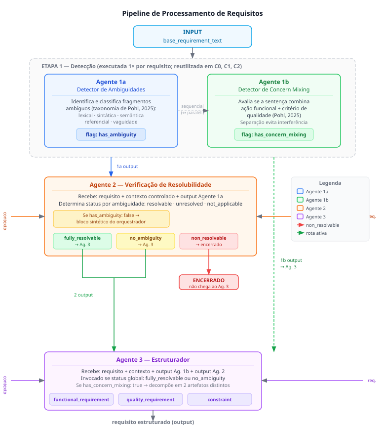
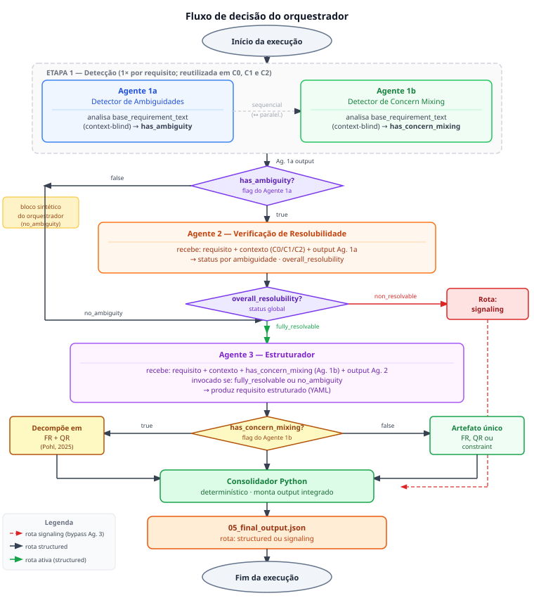

# Metodologia

Esta pesquisa caracteriza-se como estudo de natureza aplicada, exploratória e descritiva, com abordagem mista e procedimento experimental computacional. O caráter aplicado justifica-se pela investigação de uma solução computacional para um problema prático da Engenharia de Requisitos — a automação da detecção e resolução de ambiguidades em requisitos de linguagem natural. O viés exploratório decorre do uso ainda emergente de LLMs nessa área (Cheng et al., 2025; Bashir et al., 2025).

---

## Objetivos específicos

Esta pesquisa tem como objetivo geral desenvolver e avaliar um pipeline multi-agente de LLMs para detecção de ambiguidades e de mistura de preocupações estruturais, e resolução orientada por contexto, em requisitos de linguagem natural, com ênfase no impacto dos níveis de contexto controlado sobre a capacidade de resolução. Para operacionalizar esse objetivo, foram definidos os seguintes objetivos específicos:

1. Projetar e implementar o Agente 1a (Detector de Ambiguidades), responsável pela identificação e classificação de ambiguidades linguísticas segundo a taxonomia de Pohl (2025) — lexical, sintática, semântica, referencial e vaguidade —, operando sem acesso a qualquer informação contextual;
2. Projetar e implementar o Agente 1b (Detector de Concern Mixing), responsável exclusivamente pela identificação da mistura estrutural de preocupações em uma mesma sentença — presença simultânea de ação funcional e critério de qualidade (Pohl, 2025) —, também operando sem acesso a contexto;
3. Projetar e implementar o Agente 2 (Verificação de Resolubilidade), responsável por avaliar, com base no contexto controlado fornecido, se cada ambiguidade identificada pelo Agente 1a é resolúvel;
4. Projetar e implementar o Agente 3 (Estruturador), responsável pela produção do requisito estruturado nos casos em que o status global for `fully_resolvable` ou `no_ambiguity`;
5. Construir um corpus controlado de 14 requisitos em linguagem natural, distribuídos em quatro categorias de defeitos textuais e três condições de contexto;
6. Implementar um consolidador determinístico em Python para orquestrar a execução dos agentes e produzir outputs padronizados;
7. Avaliar o desempenho do pipeline por meio de quatro dimensões binárias quantitativas, calculadas automaticamente contra uma referência manual embutida no corpus; e
8. Avaliar qualitativamente os outputs do Agente 3 por meio de checklist baseado nos critérios de qualidade de Pohl (2025).

---

## Corpus controlado

Para viabilizar uma avaliação reprodutível, foi construído um corpus de 14 requisitos de linguagem natural elaborados pelo autor, precedido por uma execução-piloto com quatro requisitos elaborados pelo autor com base em padrões da literatura, cujos resultados orientaram o ajuste dos prompts e as categorias de defeito adotadas. Cada requisito foi executado sob três condições: C0 (sem contexto), C1 (contexto geral — domínio e glossário) e C2 (contexto resolutivo — regras de negócio e restrições). O corpus é descrito no Apêndice B e está disponível em Andrade (2026).

Os 14 requisitos foram distribuídos em quatro categorias: (Cat-01) estrutural, com requisitos que apresentam "concern mixing" entre preocupações funcionais e de qualidade; (Cat-02) linguística, com ambiguidades sintáticas, lexicais, referenciais ou de vaguidade de resolubilidade variada; (Cat-03) de domínio, com ambiguidades dependentes de conhecimento especializado; e (Cat-04) de controle, com requisitos intencionalmente livres de ambiguidades para verificar a taxa de falsos positivos do pipeline.

Com 14 textos-base e três condições de contexto por texto-base, o corpus totaliza 42 instâncias experimentais. Executado sobre os quatro modelos avaliados, o conjunto de experimentos compreende 168 execuções no total (42 instâncias × 4 modelos). A distinção entre texto-base — o requisito selecionado para o corpus — e instância experimental — a combinação entre requisito e condição de contexto — evita ambiguidade metodológica ao reportar os resultados.

Para cada combinação de requisito e condição, o corpus define um `manual_reference` com os campos `expected_resolubility`, `expected_actions` e `applicable_criteria`, elaborado pelo autor por análise individual de cada requisito e utilizado como gabarito para a avaliação quantitativa.

Os requisitos do corpus foram mantidos no idioma original das fontes, predominantemente em inglês. Essa decisão buscou preservar os fenômenos linguísticos analisados: a tradução de requisitos pode criar ou eliminar ambiguidades não presentes no texto original, alterando o próprio objeto de análise (Schut; Gal; Farquhar, 2025; Guo et al., 2025). Estudos recentes indicam que modelos multilíngues podem apresentar forte influência do inglês tanto em seus espaços representacionais quanto na naturalidade lexical e sintática de suas saídas em outros idiomas (Schut; Gal; Farquhar, 2025; Guo et al., 2025).

Avaliações em português demandam atenção específica às particularidades linguísticas, culturais e regionais da língua, uma vez que tarefas traduzidas podem não capturar adequadamente nuances próprias do português brasileiro (Almeida et al., 2025). Como delimitação, os resultados deste estudo referem-se a requisitos em inglês; a avaliação de pipelines de análise de requisitos em português exige corpus originalmente produzido nesse idioma e constitui extensão natural para trabalhos futuros.

---

## Arquitetura do pipeline

O pipeline é composto por quatro agentes LLM especializados e um consolidador implementado em Python. Cada agente recebe uma entrada em formato YAML e produz uma saída também em YAML. A arquitetura segue o princípio de responsabilidade única para agentes ("single responsibility"), segundo o qual cada agente deve ter um propósito claro e delimitado (Gulli, 2025). A Figura 1 ilustra os componentes e os fluxos de dados entre os agentes.

A Etapa 1 de detecção é composta por dois agentes logicamente independentes que recebem exclusivamente o texto do requisito (`base_requirement_text`), sem acesso a contexto, glossário ou metadados do corpus. Na implementação atual, são executados sequencialmente, preservando a possibilidade de paralelização futura. Como o output da Etapa 1 é determinístico e independente do contexto, é executada uma única vez por requisito e reutilizada nas três condições (C0, C1 e C2), eliminando chamadas redundantes.

O Agente 1a (Detector de Ambiguidades) identifica e classifica os fragmentos que admitem mais de uma interpretação válida segundo a taxonomia de Pohl (2025) — lexical, sintática, semântica, referencial e vaguidade — e produz o flag `has_ambiguity`. O Agente 1b (Detector de "Concern Mixing") avalia se a sentença combina uma ação funcional e um critério de qualidade (Pohl, 2025), produzindo o flag `has_concern_mixing`. A separação é intencional: critérios distintos para cada tarefa evitam interferência entre os julgamentos — padrão verificado durante a fase-piloto.

O Agente 2 (Verificação de Resolubilidade) recebe o requisito, o contexto controlado e o output do Agente 1a, e determina para cada ambiguidade um status individual (`resolvable`, `unresolved` ou `not_applicable`). Quando `has_ambiguity: false`, o Agente 2 é substituído por um bloco sintético determinístico do orquestrador, evitando chamadas desnecessárias ao modelo. O status global resultante (`fully_resolvable`, `non_resolvable` ou `no_ambiguity`) define a rota de execução: casos `non_resolvable` não chegam ao Agente 3.

O Agente 3 (Estruturador) é invocado apenas quando o status global é `fully_resolvable` ou `no_ambiguity`. O agente recebe o requisito, o contexto, o output do Agente 1b e o output do Agente 2, e produz o requisito estruturado, classificado como requisito funcional (`functional_requirement`), requisito de qualidade (`quality_requirement`) ou restrição (`constraint`). Quando o Agente 1b sinaliza `has_concern_mixing: true`, o Agente 3 decompõe o requisito em dois artefatos distintos, conforme a separação estrutural de Pohl (2025). A Figura 2 detalha o fluxo de decisão do orquestrador.

O consolidador é um script Python determinístico que orquestra a execução dos agentes, gerencia o roteamento entre as rotas `structured` e `signaling`, e persiste o output integrado no arquivo `05_final_output.json`. Diferentemente dos agentes, o consolidador não utiliza LLMs: suas decisões de roteamento são baseadas exclusivamente em regras derivadas dos campos de status retornados pelos agentes. O código-fonte completo do pipeline está disponível em Andrade (2026).

A implementação utilizou orquestração própria em Python, em vez de frameworks como LangChain ou LangGraph. Essa decisão justificou-se pelo caráter sequencial e determinístico do pipeline: como cada agente executa uma etapa previamente definida com entradas e saídas em esquema YAML fixo, a adoção de frameworks de orquestração introduziria abstrações e dependências externas sem benefício para o objetivo da pesquisa. A implementação própria garantiu controle total sobre prompts, saídas intermediárias e decisões de roteamento, preservando a rastreabilidade metodológica integral.

---

## Modelos e parâmetros de execução

Os experimentos foram conduzidos com quatro modelos de linguagem de código aberto executados localmente via Ollama: `qwen3.5:4b`, `qwen3.5:9b`, `gemma4-e4b` e `mistral:7b`. A escolha de modelos locais elimina variabilidade associada a atualizações de API remotas e permite reprodutibilidade integral das execuções. Suporte ao provedor OpenAI foi implementado como alternativa opcional na arquitetura, porém não foi utilizado nos experimentos reportados.

Para garantir determinismo nas respostas, todos os modelos foram configurados com `temperature=0.0`, eliminando amostragem estocástica e produzindo a sequência de tokens de maior probabilidade a cada passo. Adicionalmente, o parâmetro `think=false` foi aplicado aos modelos que suportam modo de raciocínio interno — especificamente `qwen3.5:4b` e `qwen3.5:9b` —, desabilitando esse modo e garantindo que a resposta seja diretamente o documento YAML especificado no prompt de sistema de cada agente. Para `gemma4-e4b` e `mistral:7b`, o parâmetro não é aplicável e foi omitido.

---

## Protocolo de avaliação

A avaliação quantitativa é implementada no script `evaluate.py` e calcula quatro dimensões binárias por execução — dimensões `not_applicable` não penalizam o modelo. As dimensões são: D1 (Detecção de Ambiguidade), que compara `has_ambiguity` com a resolubilidade esperada; D2 (Detecção de "Concern Mixing"), que verifica `has_concern_mixing` sem falsos positivos nem negativos; D3 (Rota), que verifica se a rota tomada (`structured` ou `signaling`) corresponde à esperada dado o contexto; e D4 (Output), que verifica se os campos obrigatórios do YAML do Agente 3 estão preenchidos com conteúdo substantivo.

Como os Agentes 1a e 1b operam sem acesso a contexto, D1 e D2 produzem o mesmo resultado nas três condições para um mesmo requisito. Por essa razão, D1 e D2 são analisados por categoria do corpus — para identificar em quais tipos de defeito os agentes de detecção cometem falsos positivos ou falsos negativos. D3 e D4, por dependerem do contexto fornecido ao Agente 2, são analisados comparativamente entre C0, C1 e C2.

A estrutura de análise é orientada por quatro perguntas de pesquisa: RQ1 investiga se o nível de contexto impacta a resolução do pipeline (D3 e D4 por condição); RQ2 examina se o pipeline distingue requisitos com e sem ambiguidade sem falsos positivos (D1 por categoria, com foco em Cat-04); RQ3 avalia a variação de desempenho entre as quatro categorias de defeito (D1–D4 por categoria); e RQ4 caracteriza os modos de falha predominantes — falsos positivos ou falsos negativos — e em quais dimensões se concentram.

A análise qualitativa dos outputs do Agente 3 é conduzida por um checklist de três itens derivados de Pohl (2025), aplicado sobre uma amostra representativa das instâncias com rota `structured`. Os dois primeiros itens verificam: (Q1) se o output preserva o significado original sem omissões ou adições — completude e precisão (Pohl, 2025); e (Q2) se a classificação do tipo de requisito está correta e, quando há "concern mixing", a decomposição em dois artefatos atômicos é semanticamente válida (Pohl, 2025).

O terceiro item (Q3) verifica se o output não introduz condições ausentes no texto-base e no contexto fornecido — critério de verificabilidade (Pohl, 2025). Os resultados qualitativos são cruzados com D4: quando D4 indica completude estrutural mas algum item resulta em Não, o caso evidencia uma limitação do indicador quantitativo — output estruturalmente completo, mas semanticamente inadequado. O checklist completo, com critérios de decisão por item, está apresentado no Apêndice A.

Como delimitação metodológica, os experimentos foram conduzidos com modelos de código aberto de parâmetros reduzidos executados localmente. A comparação entre os quatro modelos tem caráter exploratório — serve para verificar se os achados são consistentes entre implementações distintas do pipeline, não para ranquear modelos. A replicação em condições distintas constitui extensão relevante para trabalhos futuros.