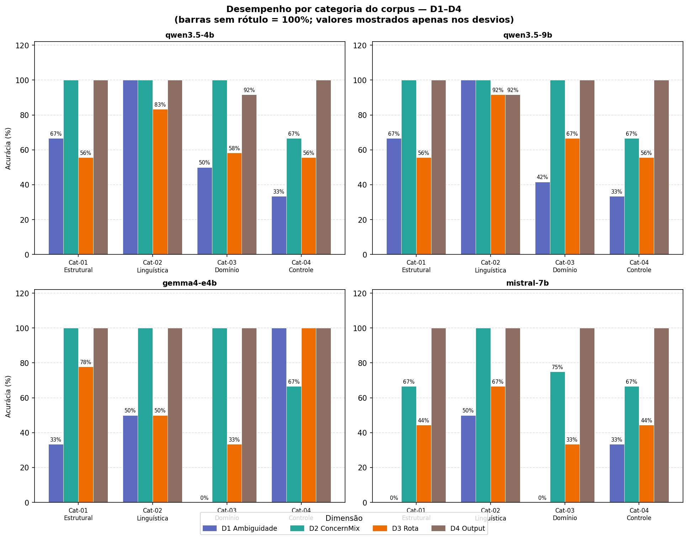
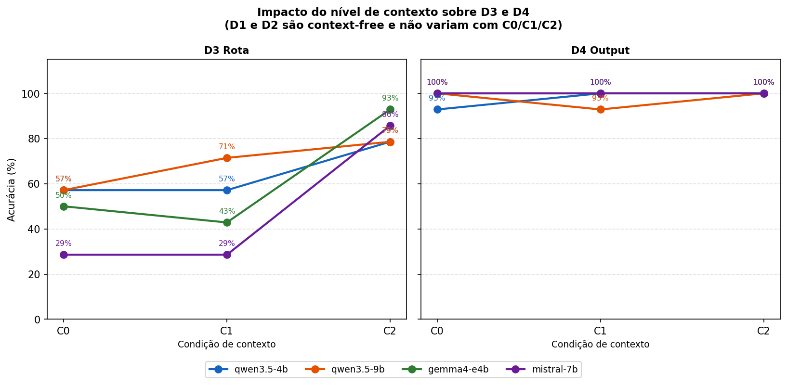
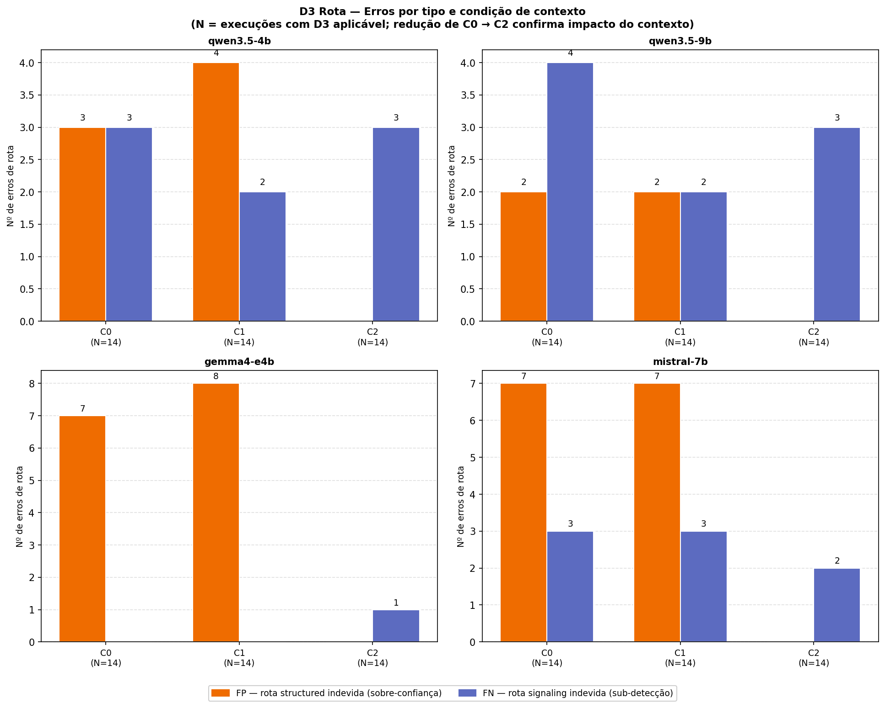
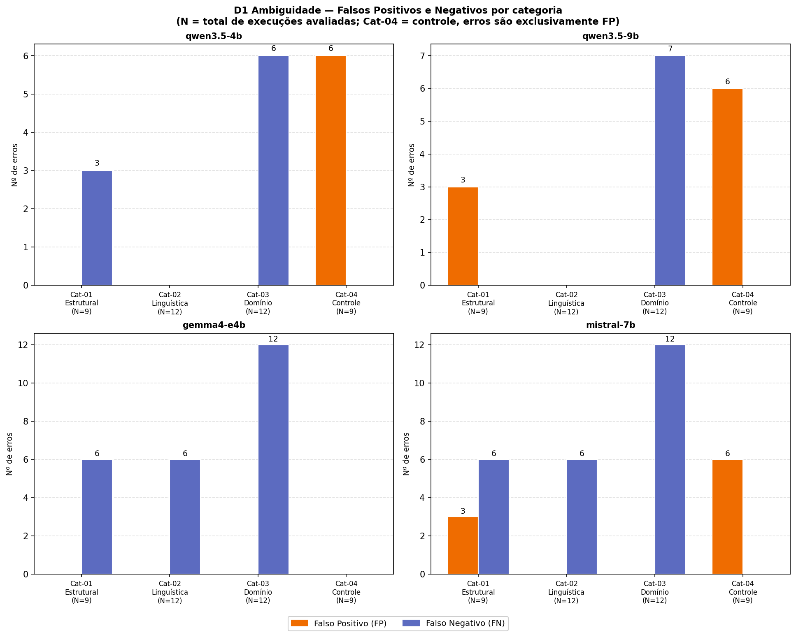
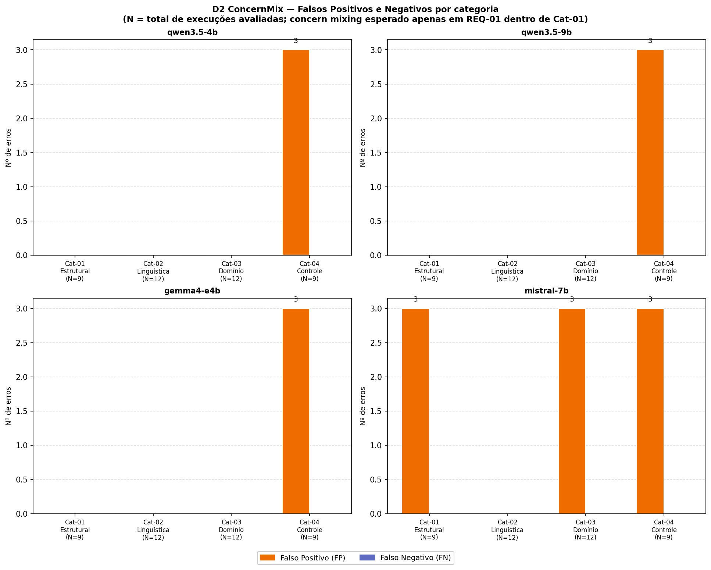

# Resultados Preliminares

Os resultados apresentados nesta seção são baseados em 168 execuções do pipeline — 42 instâncias experimentais (14 requisitos × 3 condições de contexto) executadas sobre quatro modelos de linguagem: `qwen3.5-4b`, `qwen3.5-9b`, `gemma4-e4b` e `mistral-7b`. Cada execução foi avaliada automaticamente pelo script `evaluate.py` nas quatro dimensões binárias descritas no Protocolo de Avaliação. A análise qualitativa dos outputs do Agente 3 pelo checklist do Apêndice A será conduzida na versão final do trabalho.

---

## Perfil geral do pipeline

A Figura 1 apresenta a acurácia do pipeline nas quatro dimensões por categoria e modelo. D4 (Output) atingiu desempenho próximo ao teto em todos os modelos — entre 97,6% e 100% —, indicando que o Agente 3, quando invocado, produz outputs estruturalmente completos de forma consistente. D2 (Detecção de "Concern Mixing") também apresentou desempenho elevado na maioria dos modelos, entre 78,6% (`mistral-7b`) e 92,9% (demais modelos).

D3 (Rota) e D1 (Detecção de Ambiguidade) concentraram os erros do pipeline. D3 variou entre 47,6% (`mistral-7b`) e 69,0% (`qwen3.5-9b`) quando consolidado sobre as três condições — resultado esperado, pois a condição C0 reduz a média. D1 apresentou a maior variância entre modelos: de 21,4% (`mistral-7b`) a 64,3% (`qwen3.5-4b`), revelando diferenças substanciais na capacidade de detecção de ambiguidade entre as implementações testadas.

---

## Impacto do contexto sobre a resolubilidade (RQ1)

A Figura 2 apresenta a acurácia de D3 e D4 pelas três condições de contexto (C0, C1, C2) para cada modelo. O efeito do contexto sobre D3 foi consistente e expressivo em todos os modelos, confirmando a hipótese central da pesquisa de que o contexto controlado melhora a capacidade de resolução do pipeline.

Em C0 (sem contexto), D3 variou entre 28,6% (`mistral-7b`) e 57,1% (modelos `qwen`). Em C2 (contexto resolutivo), todos os modelos convergiram para desempenho entre 78,6% e 92,9% — uma elevação de 28 a 57 pontos percentuais em relação a C0. O maior salto foi observado em `gemma4-e4b` (C0: 50,0% → C2: 92,9%) e `mistral-7b` (C0: 28,6% → C2: 85,7%), ambos com ganho superior a 40 pontos percentuais.

A análise do ponto de inflexão revelou padrões distintos entre modelos. Os modelos `qwen` apresentaram ganho distribuído entre C0→C1 e C1→C2, sugerindo que o contexto geral (domínio e glossário) já contribui para a resolubilidade. Os modelos `gemma4-e4b` e `mistral-7b` mantiveram desempenho praticamente estável entre C0 e C1, com salto expressivo apenas em C2 — indicando que regras de negócio e restrições operacionais são condição necessária para a melhoria de D3 nesses modelos.

A Figura 3 detalha os erros de D3 por tipo (falso positivo e falso negativo) e condição. Em C0 e C1, os erros foram predominantemente falsos positivos — o pipeline escolheu a rota `structured` quando deveria ter sinalizado ambiguidade não resolúvel (C0: 19 FP e 10 FN; C1: 21 FP e 7 FN).

Em C2, os falsos positivos foram completamente eliminados (0 FP), permanecendo apenas 9 falsos negativos — cujas causas são detalhadas na seção Modos de falha predominantes (RQ4).

As duas falhas pontuais de D4 registradas durante os experimentos são descritas na seção Limitações (L3).

---

## Capacidade por tipo de defeito (RQ3)

Em Cat-02 (ambiguidades linguísticas), a acurácia de D1 atingiu 100% nos modelos `qwen` — todos os requisitos linguisticamente ambíguos foram corretamente identificados — e 50% nos modelos `gemma4-e4b` e `mistral-7b`. Em Cat-03 (ambiguidades de domínio), a acurácia de D1 caiu para 0% em `gemma4-e4b` e `mistral-7b` e para 41,7–50,0% nos modelos `qwen` — o pior desempenho do pipeline por categoria.

Importa notar que os requisitos de Cat-03 contêm ambiguidades detectáveis no próprio texto — termos sem definição objetiva ("medium-sized", "dial tone") ou regras de avaliação ausentes —, de modo que o Agente 1a poderia, em princípio, sinalizá-las sem acesso a contexto. O que Cat-03 testa é a meta-consciência do modelo: reconhecer que um termo carece de definição de domínio sem precisar conhecer o domínio para chegar a essa conclusão.

Os resultados revelam um padrão distinto entre modelos: `gemma4-e4b` e `mistral-7b`, com maior conhecimento geral, reconhecem termos como "dial tone" e os consideram não-ambíguos por já possuírem uma representação interna do conceito; os modelos `qwen`, mais cautelosos, questionam parte dos casos, mas ainda erram. Esse comportamento aponta para uma limitação de design do prompt descrita na seção Limitações (L2), não apenas para diferença de capacidade entre modelos.

Cat-04 (grupo de controle) revelou comportamentos opostos entre modelos em D1: `gemma4-e4b` atingiu 100% sem nenhum falso positivo, enquanto `qwen3.5-4b`, `qwen3.5-9b` e `mistral-7b` ficaram em 33,3%, sinalizando ambiguidade em requisitos intencionalmente livres de defeitos. D2 foi consistente entre as categorias Cat-01, Cat-02 e Cat-03 na maioria dos modelos, com exceção de Cat-04, onde todos os modelos apresentaram 66,7% — padrão atribuível integralmente à Limitação L1 descrita na seção Limitações.

---

## Modos de falha predominantes (RQ4)

As Figuras 4 e 5 apresentam a distribuição de falsos positivos e falsos negativos de D1 e D2 por categoria. A Figura 3 (a seção Impacto do Contexto) complementa a análise com os erros de D3 por condição de contexto.

Em D1, os erros foram assimétricos por categoria: Cat-03 concentrou 37 FN em 48 instâncias — o Agente 1a sistematicamente não detectou ambiguidades dependentes de conhecimento de domínio. Cat-04 concentrou 18 FP em 36 instâncias — o agente sinalizou ambiguidade onde o corpus garante que não há. Cat-02 registrou apenas FN (12), sem nenhum FP, indicando sub-detecção sem excesso de sensibilidade. A consistência desses padrões entre modelos sugere que os modos de falha refletem limitações do design do prompt do Agente 1a, não de capacidade específica de cada modelo.

Em D2, todos os erros registrados foram falsos positivos — nenhum requisito com "concern mixing" esperado deixou de ser detectado. Os 18 FP distribuíram-se entre Cat-04 (12 FP, atribuíveis integralmente à Limitação L1) e Cat-01 e Cat-03 (3 FP cada). A ausência total de falsos negativos indica que o Agente 1b tende à sobre-detecção: é sensível o suficiente para não perder casos reais, mas produz falsos positivos em requisitos com padrão estrutural similar ao do defeito sem que o defeito esteja presente.

Em D3, o perfil de erros inverteu-se entre condições: C0 e C1 foram dominados por FP (sobre-confiança do pipeline), enquanto C2 eliminou os FP completamente, permanecendo apenas FN. Esse padrão confirma que o contexto resolutivo corrige a tendência de sobre-estruturação. Os 9 FN remanescentes em C2 não decorrem de insuficiência do contexto — o corpus define todos os casos como resolúveis em C2 —, mas de dificuldade do Agente 2 em extrair do contexto resolutivo as evidências necessárias para classificar a ambiguidade como resolúvel.

---

## Limitações identificadas

### L1 — Definição operacional de "concern mixing" insuficientemente granular no Agente 1b

A análise dos falsos positivos de D2 revelou que todos os modelos avaliados produzem 3 FP no requisito REQ-14 (Cat-04), cuja formulação é:

> "R-Q-2: The system shall inform the security service within 2 s after detecting damage."

REQ-14 foi construído deliberadamente como o sub-requisito de qualidade resultante da decomposição de REQ-01 — o output esperado do pipeline para "concern mixing" aplicado corretamente. Ao detectá-lo como mistura de preocupações, os modelos reaplicam a separação sobre um requisito já separado, caracterizando um falso positivo genuíno. A causa raiz é uma lacuna no prompt do Agente 1b: o critério não distingue entre requisito ainda não separado (REQ-01) e requisito de qualidade já isolado (REQ-14) — distinção fundamentada em atomicidade por Pohl (2025).

Os 12 FP de D2 em Cat-04 são, na totalidade, atribuíveis a esta limitação. A acurácia de D2 em Cat-04 (66,7%) subestima a capacidade real do pipeline: corrigida a definição, o desempenho esperado seria 100%. Para a versão final, propõe-se adicionar ao prompt do Agente 1b uma regra de exclusão explícita para requisitos de qualidade já isolados, acompanhada de um exemplo negativo confirmado análogo a REQ-14.

---

### L2 — Taxonomia de Pohl não cobre ambiguidades de especificação de domínio no prompt do Agente 1a

A análise dos falsos negativos de D1 em Cat-03 revelou que os erros não se devem apenas a diferenças de capacidade entre modelos, mas a uma limitação de design do prompt do Agente 1a.

Os requisitos de Cat-03 contêm termos linguisticamente precisos — como "dial tone" (REQ-10) e "filter network traffic" (REQ-11) — cujos parâmetros técnicos dependem de padrões de domínio não declarados no requisito. A taxonomia de Pohl (2025) não possui categoria para esse tipo de lacuna: `vagueness` exige extensão fuzzy; `lexical`, múltiplos significados comuns — nenhum se aplica a termos tecnicamente subespecificados. Isso induz modelos com maior conhecimento geral (`gemma4-e4b`, `mistral-7b`) a tratar tais termos como não-ambíguos; os modelos `qwen`, mais cautelosos, questionam parte dos casos sem consistência.

**Impacto nos resultados:** os 37 FN de D1 em Cat-03 são parcialmente atribuíveis a esta limitação — a ausência de uma instrução explícita para flagrar termos tecnicamente subespecificados induz os modelos a aplicar conhecimento geral em vez de reconhecer a lacuna definitória.

**Melhoria proposta para a versão final:** adicionar ao prompt do Agente 1a uma instrução explícita para flagrar termos cujos parâmetros técnicos dependem de padrões ou definições de domínio ausentes do texto, mesmo que o termo seja linguisticamente não-ambíguo. Uma regra possível seria: "If a term has a technically specific meaning whose concrete parameters (values, thresholds, standards) are domain-defined and absent from the requirement text, flag it as lexical ambiguity with context_dependency: high."

---

### L3 — Robustez de parsing do Agente 2

As duas únicas falhas de D4 nos experimentos — `qwen3.5-4b` em REQ-08/C0 e `qwen3.5-9b` em REQ-06/C1 — não decorrem de inadequação do Agente 3, mas de falhas de parsing do Agente 2: o modelo retornou YAML inválido, o orquestrador defaultou para `non_resolvable` e tomou a rota `signaling`, porém o output de sinalização ficou com campos obrigatórios preenchidos de forma incompleta. Trata-se de problema pontual de robustez ante respostas malformadas, sem relação com o nível de contexto da condição.

Para a versão final, recomenda-se adotar estratégias de parsing tolerante a falhas — como tentativas de correção do YAML malformado antes do default para `non_resolvable` —, eliminando essa classe de erro sem alterar a lógica de roteamento do pipeline. A avaliação de D4 será ainda complementada pelo checklist qualitativo do Apêndice A, verificando se a completude estrutural medida quantitativamente corresponde à adequação semântica dos requisitos estruturados.
