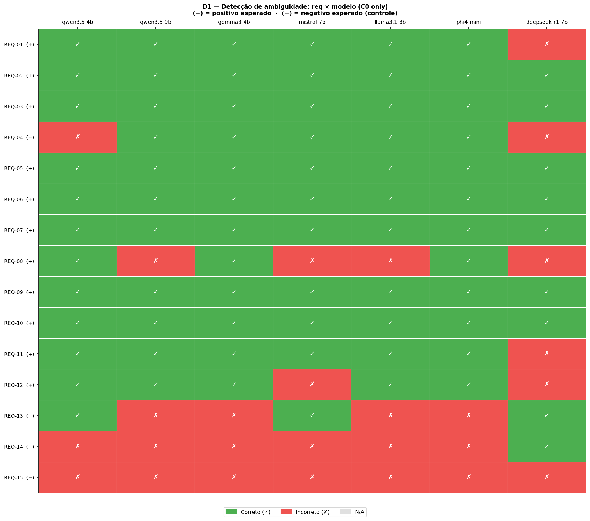
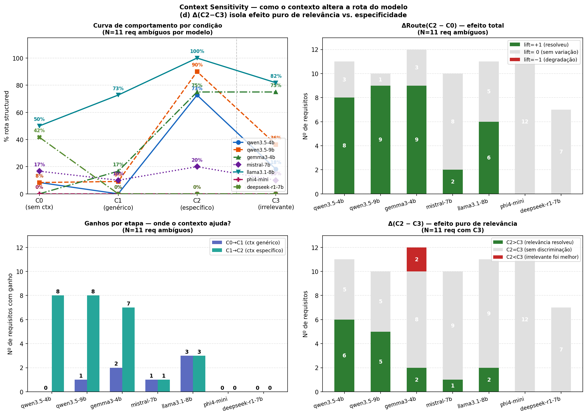
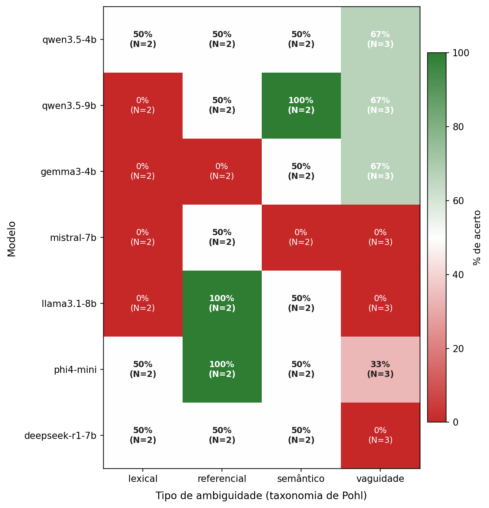

# Resultados e Discussão

Os resultados são apresentados na sequência dos quatro blocos do protocolo de avaliação, em correspondência com os subtítulos da seção de Material e Métodos. Ao final da seção, as perguntas de pesquisa e as hipóteses são respondidas diretamente com base nos dados.

## Bloco 1 — Detecção de ambiguidade

O Bloco 1 avaliou a capacidade do Agente 1 de detectar ambiguidades nas 15 execuções em C0 de cada modelo, respondendo a RQ2. A Tabela 1 apresenta os contadores de classificação e as métricas derivadas.

**Tabela 1.** Métricas de detecção de ambiguidade em C0 por modelo (n = 15)

| Modelo | TP | FP | FN | TN | Precisão | Revocação | F1 | Especificidade |
|---|---:|---:|---:|---:|---:|---:|---:|---:|
| qwen3.5-4b | 11 | 2 | 1 | 1 | 84,6% | 91,7% | 88,0% | 33,3% |
| qwen3.5-9b | 11 | 3 | 1 | 0 | 78,6% | 91,7% | 84,6% | 0,0% |
| gemma3-4b | 12 | 3 | 0 | 0 | 80,0% | 100,0% | 88,9% | 0,0% |
| mistral-7b | 10 | 2 | 2 | 1 | 83,3% | 83,3% | 83,3% | 33,3% |
| llama3.1-8b | 11 | 3 | 1 | 0 | 78,6% | 91,7% | 84,6% | 0,0% |
| phi4-mini | 12 | 3 | 0 | 0 | 80,0% | 100,0% | 88,9% | 0,0% |
| deepseek-r1:7b | 7 | 1 | 5 | 2 | 87,5% | 58,3% | 70,0% | 66,7% |

*Fonte: Resultados originais da pesquisa*

Dois perfis de comportamento emergiram dos dados. O primeiro, de alta revocação, reuniu gemma3-4b e phi4-mini, que não produziram falsos negativos: todos os 12 requisitos ambíguos foram sinalizados, ao custo de alarmar também os três requisitos do grupo de controle negativo (Cat-05), resultando em especificidade nula.

O segundo perfil, representado pelo deepseek-r1:7b, inverteu essa relação: o modelo registrou a maior precisão do conjunto (87,5%) e a maior especificidade (66,7%), ao custo de cinco falsos negativos — requisitos ambíguos não sinalizados em C0 que, em consequência, não receberam execuções em C1, C2 e C3. Os demais modelos concentraram-se em revocação entre 83,3% e 91,7% e precisão entre 78,6% e 84,6%, configurando um perfil equilibrado.

A especificidade nula observada para quatro modelos refletiu, em parte, a limitação do grupo de controle: três instâncias Cat-05 produzem um denominador mínimo para a estimação, de modo que um único falso positivo reduz a especificidade para 66,7% e dois a reduzem para 33,3%. A interpretação desse indicador demandou cautela em razão do tamanho do grupo de controle.

A revocação em C0 (83,3% a 100,0% em seis modelos) superou a relatada em estudos com modelos isolados, sem "prompts" especializados: Shefa et al. (2026), em um "benchmark" de dez modelos das famílias OpenAI e Anthropic para avaliação de qualidade de requisitos, documentaram revocação mediana de 47% no melhor modelo.

O F1 em C0 (83,3% a 88,9% em seis modelos) também superou os 75,8% obtidos por Bashir et al. (2025) com modelos de código aberto em requisitos industriais. Esse desempenho, porém, conviveu com baixa especificidade sobre o controle (0,0% a 66,7%), de modo que a vantagem se restringiu à detecção dos requisitos ambíguos.

No contexto de detecção de ambiguidade pragmática com abordagem de recuperação aumentada, Nair e Anish (2025) reportaram, em dois documentos, revocação macro-média de 75% e 76% para o GPT-4o-mini e de 60% a 64% para o Mistral-7B e o Llama-3.1-8B, também avaliados neste experimento, que obtiveram 83,3% e 91,7% em C0. As comparações com esses estudos devem ser interpretadas com reserva: os corpora, os critérios de avaliação e as formas de cômputo das métricas diferem entre eles.

Os IC de 95% por "bootstrap" tiveram amplitude ampla em todos os modelos, reflexo das 15 execuções em C0. No deepseek-r1:7b, o IC da revocação foi [30,0%; 84,6%], reflexo dos cinco falsos negativos; nos demais, os limites inferiores foram iguais ou superiores a 60,0% na revocação e a 63,2% no F1. Os IC indicam que o corpus de 15 requisitos não sustenta afirmações quantitativas fortes sobre superioridade entre modelos.

A Figura 2 apresenta o mapa de acerto da detecção por requisito e modelo, revelando padrões de falha não capturados pelas métricas agregadas da Tabela 1.

Figura 2. Mapa de acerto da detecção de ambiguidade por requisito e modelo em C0. (+) indica positivo esperado; (−) indica negativo esperado (grupo de controle)

*Fonte: Resultados originais da pesquisa*

O exame por requisito revelou dois padrões de falha sistemática. O REQ-08 (Cat-03, domínio) foi o único requisito com falso negativo em quatro dos sete modelos (qwen3.5-9b, mistral-7b, llama3.1-8b e deepseek-r1:7b), caracterizando-o como o texto-base de maior dificuldade de detecção do corpus — possivelmente por apresentar ambiguidade lexical de domínio sem marcadores sintáticos salientes que ancorem a identificação.

O segundo padrão ocorreu no grupo de controle: o REQ-15 (Cat-05) foi sinalizado incorretamente como ambíguo pelos sete modelos, o REQ-14 por seis e o REQ-13 por quatro. O deepseek-r1:7b acertou o REQ-13 e o REQ-14, o que explica sua especificidade de 66,7%. Esse resultado indicou que todos os modelos perceberam como problemático ao menos um dos requisitos intencionalmente bem formados do corpus — limitação que fundamenta a interpretação cautelosa da especificidade reportada na Tabela 1.

A sinalização de requisitos bem formados também aparece em modelos proprietários. Shefa et al. (2026) reportaram, para o melhor modelo avaliado, taxa de falsos positivos mediana de 11% no conjunto dos critérios e de 33% no critério de ambiguidade, com variação de 11% a 78% entre 100 execuções. As taxas do controle deste experimento, de 33,3% a 100,0% em C0, situaram-se na mesma faixa ou acima. A comparação exige reserva: critérios, requisitos e número de itens diferem, e o controle teve apenas três requisitos.

Os cinco falsos negativos do deepseek-r1:7b distribuíram-se por quatro categorias distintas (Cat-01, Cat-02, Cat-03 e Cat-04), sem concentração em uma categoria específica, o que indicou conservadorismo generalizado na detecção em vez de lacuna restrita a um tipo de ambiguidade.

## Bloco 2 — Sensibilidade ao contexto

O Bloco 2 rastreou a rota do "pipeline" nas quatro condições de contexto, respondendo a RQ1, com base em ΔRoute(C2 − C0) — a proporção de requisitos que passaram de `signaling` a `structured` ao receber o contexto específico relevante (C2) — e em ΔRoute(C3 − C1), que isolou o efeito da especificidade do contexto, com relevância constante.

A Tabela 2 apresenta, por modelo, a média de ΔRoute em cada contraste, e a Figura 3 ilustra o comportamento de cada modelo ao longo das quatro condições.

**Tabela 2.** Proporções de conversão de rota por condição de contexto (base: requisitos de Cat-01 a Cat-04 detectados pelo Agente 1 em C0)

| Modelo | n | ΔC2−C0 | ΔC3−C0 | ΔC2−C3 | ΔC3−C1 | C0→C1 | C1→C2 |
|---|---:|---:|---:|---:|---:|---:|---:|
| qwen3.5-4b | 11 | 72,7% | 18,2% | 54,5% | 18,2% | 0,0% | 72,7% |
| qwen3.5-9b | 10 | 90,0% | 40,0% | 50,0% | 30,0% | 10,0% | 80,0% |
| gemma3-4b | 12 | 75,0% | 75,0% | 0,0% | 58,3% | 16,7% | 58,3% |
| mistral-7b | 10 | 20,0% | 10,0% | 10,0% | 0,0% | 10,0% | 10,0% |
| llama3.1-8b | 11 | 54,5% | 36,4% | 18,2% | 9,1% | 27,3% | 27,3% |
| phi4-mini | 12 | 0,0% | 0,0% | 0,0% | 0,0% | 0,0% | 0,0% |
| deepseek-r1:7b | 7 | 0,0% | 0,0% | 0,0% | 0,0% | 0,0% | 0,0% |

*Fonte: Resultados originais da pesquisa*

Nota: ΔC3−C1 do llama3.1-8b resulta de dois requisitos convertidos e um revertido (`structured` em C1, `signaling` em C3); nas demais células não houve reversões, exceto em ΔC2−C3 do gemma3-4b, com dois requisitos favoráveis a C2 e dois a C3. O n = 10 do qwen3.5-9b, contra 11 detecções em Cat-01 a Cat-04 na Tabela 1, decorre de REQ-05 em C2, que não gerou artefato (Bloco 4). Nos testes de H1, o llama3.1-8b teve dois pares favoráveis a C2 e um a C3, este em Cat-05; em Cat-01 a Cat-04, o saldo é de +2 requisitos (ΔC2−C3 = 18,2%).

Figura 3. Padrões de sensibilidade ao contexto por modelo, sobre a base da Tabela 2: (a) trajetória C0–C3, com o n de cada modelo na legenda; (b) ΔRoute(C2 − C0); (c) ganhos por estágio C0→C1 e C1→C2; (d) pares C2 versus C3

*Fonte: Resultados originais da pesquisa*

Os modelos da família qwen apresentaram a maior discriminação nominal entre contexto relevante e irrelevante. O qwen3.5-4b converteu 72,7% das rotas `signaling` em `structured` ao receber C2, contra 18,2% em C3 — uma diferença de 54,5 pontos percentuais. O qwen3.5-9b exibiu padrão análogo, com 90,0% em C2 e 40,0% em C3 (Δ = 50,0 pp); esse modelo contribuiu com 12 pares C2/C3, e não 14, em razão das falhas de execução descritas no Bloco 4.

O teste exato binomial unilateral indicou significância ao nível nominal de 0,05 para ambos (qwen3.5-4b: n_discordante = 6, p = 0,016; qwen3.5-9b: n_discordante = 5, p = 0,031), com nenhuma vitória de C3 sobre C2 nos pares discordantes. Após a correção de Bonferroni sobre os sete modelos (α ≈ 0,007), porém, nenhum dos dois resultados permaneceu significativo; a correção de Holm-Bonferroni aplicada apenas aos dois testes os manteria significativos (p ajustado = 0,031), leitura menos conservadora que não foi adotada como critério principal.

O ganho de conversão se concentrou inteiramente no estágio C1→C2 para o qwen3.5-4b (72,7%) e majoritariamente nesse estágio para o qwen3.5-9b (80,0%), indicando que a etapa relevante para a resolução foi a injeção do conteúdo específico relevante, não a adição de contexto periférico (C0→C1 = 0% e 10%, respectivamente). O efeito da especificidade isolada, medido por ΔC3−C1, foi menor que o da relevância nos dois modelos (18,2% contra 54,5% no qwen3.5-4b; 30,0% contra 50,0% no qwen3.5-9b).

O gemma3-4b apresentou comportamento distinto: ΔC2−C0 e ΔC3−C0 foram idênticos (75,0%), resultando em ΔC2−C3 = 0,0%. O modelo converteu rotas tanto com contexto relevante quanto com contexto irrelevante de mesma especificidade, sem distinguir qual dos dois endereçava o fragmento ambíguo. Em dois requisitos das categorias Cat-02 e Cat-03, a conversão ocorreu exclusivamente em C3 (contexto irrelevante) e não em C2.

Esse padrão sugere sensibilidade à especificidade do texto injetado, independente de sua relevância. O contraste ΔC3−C1 o corroborou: sete dos 12 requisitos (58,3%) converteram em C3 sem terem convertido em C1, e nenhum seguiu o caminho inverso. O teste de McNemar reportou poder estatístico insuficiente (n_discordante = 4), impossibilitando inferência.

O phi4-mini e o deepseek-r1:7b registraram ΔRoute = 0,0% em todas as condições. O phi4-mini, com revocação de 100% no Bloco 1, detectou todas as ambiguidades, mas não considerou nenhuma resolúvel com qualquer volume de contexto, padrão de conservadorismo na resolução independente do insumo. No deepseek-r1:7b, os cinco falsos negativos em C0 reduziram a base a sete requisitos, todos roteados para `signaling`, sem conversão por C1, C2 ou C3.

Por isso, os dois modelos não permitiram testar H1: como não converteram nenhuma rota, a ausência de diferença entre C2 e C3 decorre de o "pipeline" nunca ter alcançado a rota `structured`, e não de eles ignorarem a relevância do contexto.

O llama3.1-8b apresentou particularidade relevante: cinco dos 11 requisitos ambíguos (45,5%) foram roteados para `structured` já em C0, sem qualquer contexto adicional. Esse patamar elevado de resolução autônoma comprimiu os deltas observados em condições superiores, de modo que o ΔC2−C0 de 54,5% subestima a sensibilidade real do modelo ao contexto: todos os seis requisitos que o modelo não resolveu em C0 foram convertidos em C2, mas a base de cálculo incluiu também os cinco que já estavam resolvidos.

Esses resultados, tomados como indício exploratório, foram compatíveis com a observação de Bashir et al. (2025) de que estratégias de "prompting" com informação contextual elevaram o desempenho de LLMs na tarefa de detecção de ambiguidades industriais — embora o mecanismo tenha sido distinto: enquanto Bashir et al. injetaram exemplos de requisitos rotulados como demonstrações (aprendizado em contexto de poucos exemplos), o presente "pipeline" injetou documentação de domínio diretamente relacionada ao requisito analisado.

A heterogeneidade da resposta — nominalmente significativa apenas nos modelos qwen — indica que a simples disponibilidade da informação não garantiu o aproveitamento do contexto injetado; como tamanho, arquitetura e treinamento variaram juntos entre os modelos, o estudo não isolou a causa dessa diferença.

A não confirmação de H1 não equivale, contudo, à ausência de efeito. Em nenhum modelo o saldo de pares discordantes favoreceu C3 sobre C2: foi positivo nos dois qwen (+6 e +5), no mistral-7b e no llama3.1-8b (+1 em ambos) e nulo nos demais. O padrão é compatível com um efeito real da relevância, mas os dados não têm poder para sustentá-lo: com no máximo 15 pares e seis discordantes por modelo, apenas diferenças extremas superariam o limiar corrigido, conservador para sete testes.

Uma limitação central da interpretação é que o Bloco 2 mede a rota adotada, e não a correção da resolução: não havia gabarito de rota esperada por condição. Assim, a conversão em C3 pode indicar resolução indevida, isto é, o Agente 2 aceitar contexto irrelevante como evidência, e não apenas sensibilidade legítima ao contexto. Estudos futuros com um corpus maior e um gabarito da resolução esperada poderiam distinguir a conversão correta da indevida e conferir poder estatístico à comparação entre C2 e C3.

## Bloco 3 — Classificação de tipo de ambiguidade

O Bloco 3 avaliou se o tipo de ambiguidade detectado pelo Agente 1 coincidiu com os tipos aceitos declarados no corpus, respondendo a RQ3. A análise restringiu-se às categorias Cat-02, Cat-03 e Cat-04, que possuem `taxonomy_accepted_types` preenchido. A Tabela 3 apresenta a proporção de acerto por categoria e por modelo.

**Tabela 3.** Proporção de acerto de tipo de ambiguidade por categoria e modelo em C0 (acertos/3 por célula)

| Modelo | Cat-02 Linguística | Cat-03 Domínio | Cat-04 Vaguidade |
|---|---:|---:|---:|
| qwen3.5-4b | 66,7% (2/3) | 66,7% (2/3) | 66,7% (2/3) |
| qwen3.5-9b | 66,7% (2/3) | 33,3% (1/3) | 66,7% (2/3) |
| gemma3-4b | 33,3% (1/3) | 0,0% (0/3) | 66,7% (2/3) |
| mistral-7b | 66,7% (2/3) | 0,0% (0/3) | 0,0% (0/3) |
| llama3.1-8b | 66,7% (2/3) | 33,3% (1/3) | 0,0% (0/3) |
| phi4-mini | 100,0% (3/3) | 33,3% (1/3) | 33,3% (1/3) |
| deepseek-r1:7b | 66,7% (2/3) | 33,3% (1/3) | 0,0% (0/3) |

*Fonte: Resultados originais da pesquisa*

A Figura 4 detalha a acurácia segundo os tipos da taxonomia de Pohl (2025): lexical, referencial, semântico e vaguidade. Ela adota um critério mais estrito que o da Tabela 3: agrupa os requisitos pelo primeiro tipo da lista aceita e considera acerto apenas quando todos os tipos detectados pertencem ao conjunto aceito, de modo que a detecção de um tipo adicional fora desse conjunto é contada como erro.

Figura 4. Acurácia de classificação de tipo de ambiguidade por tipo da taxonomia de Pohl e modelo em C0

*Fonte: Resultados originais da pesquisa*

A Figura 4 revelou padrões heterogêneos entre tipos e modelos. O tipo vaguidade foi o de menor acurácia, isolado ou empatado, em quatro dos sete modelos (mistral-7b, llama3.1-8b, phi4-mini e deepseek-r1:7b, com 0 a 33%), mas atingiu 66,7% nos dois qwen e no gemma3-4b, evidenciando que nenhum modelo dominou consistentemente a distinção entre imprecisão de fronteira e demais formas de indefinição textual.

O tipo referencial apresentou acurácia elevada especificamente nos modelos llama3.1-8b e phi4-mini (100% em ambos), sugerindo que pronomes sem referente inequívoco constituem uma forma de ambiguidade com padrões linguísticos suficientemente salientes para modelos específicos.

O tipo semântico exibiu a maior variação intermodelos: qwen3.5-9b registrou 100%, enquanto os demais modelos obtiveram 50% ou menos. Como cada célula do tipo semântico reuniu apenas dois requisitos, a diferença equivale a um requisito e não permite atribuí-la ao pré-treinamento ou ao "prompting". Os perfis por tipo diferiram entre os modelos, mas o corpus não sustenta afirmar que sejam estáveis; o uso de composição heterogênea de "pipeline" permanece, assim, como hipótese para trabalhos futuros.

Cat-02 (linguística) registrou o melhor desempenho: seis dos sete modelos acertaram dois ou três dos três requisitos, com mediana de 66,7%. Os requisitos dessa categoria apresentam marcadores textuais reconhecíveis — pronomes sem referente inequívoco, estruturas de coordenação com escopo ambíguo —, o que pode ter favorecido sua classificação, embora o estudo não tenha isolado essa causa.

Cat-03 (domínio) revelou limitações sistemáticas: gemma3-4b e mistral-7b não acertaram nenhum dos três requisitos. Dos 15 erros, quatro foram requisitos não detectados (REQ-08); nos 11 restantes, o REQ-07, de tipo aceito semântico, foi rotulado como vaguidade em quatro casos, e os de tipo aceito lexical (REQ-08 e REQ-09), como semânticos em cinco, como vaguidade em um e como sintático em um. A troca entre tipos vizinhos é compatível com uma categoria que dependia de definições operacionais de domínio, ausentes em C0.

Em Cat-04 (vaguidade), mistral-7b, llama3.1-8b e deepseek-r1:7b registraram 0,0% de acerto, o phi4-mini, 33,3%, e os dois qwen e o gemma3-4b, 66,7%. A vaguidade, na taxonomia de Pohl (2025), exige reconhecer que um predicado é objetivamente inverificável por imprecisão de fronteira, distinção sutil que não emergiu do "prompting" adotado. Dos 14 erros, três foram requisitos não detectados; os 11 restantes somaram 12 rótulos divergentes, pois um caso (REQ-10) recebeu dois: lexical (seis ocorrências, em llama3.1-8b, mistral-7b e phi4-mini), sintático (três), semântico (duas) e referencial (uma).

O phi4-mini apresentou o único caso de acerto perfeito em qualquer categoria: 100% em Cat-02. Combinado com o desempenho nulo do mesmo modelo no Bloco 2, esse resultado indicou que a capacidade de nomear corretamente o tipo de ambiguidade linguística de superfície não se traduziu em capacidade de resolução — o modelo discriminou o tipo mas não produziu requisito estruturado.

A observação de que modelos com alta revocação não necessariamente classificam tipos corretamente sugere um gargalo de granularidade: os modelos detectaram a ambiguidade em termos genéricos, mas nem sempre lhe atribuíram o subtipo do gabarito. Parte do resultado decorre de a detecção falhar antes da classificação: dos 63 casos das três categorias, nove foram requisitos não detectados em C0, quatro deles do deepseek-r1:7b, e contaram como erro de tipo.

A fronteira entre tipos também se mostrou tênue: Bashir et al. (2025) apontaram que requisitos frequentemente apresentaram formas sobrepostas de ambiguidade e pertenceram a mais de uma categoria, o que dificultou enquadrá-los em uma só, situação compatível com as trocas entre tipos vizinhos, como lexical e semântico, observadas em Cat-03.

## Bloco 4 — Integridade estrutural

O Bloco 4 aferiu se o "pipeline" produziu artefatos utilizáveis em todas as condições. Dadas as detecções em C0, o experimento previa 378 execuções, abaixo do teto de 420 (15 requisitos × 4 condições × 7 modelos), pois C1, C2 e C3 só foram executadas para requisitos com ambiguidade detectada. Dessas, 375 geraram artefato, e a integridade estrutural (indicador D_output) delas atingiu 100% nos sete modelos e nas quatro condições de contexto.

As três execuções restantes (0,8%), todas do qwen3.5:9b, não geraram artefato, pois a resposta do modelo não pôde ser convertida em YAML: REQ-05 em C2 (Agente 2) e REQ-13 em C2 e C3 (Agente 3). No primeiro caso, o raciocínio interno do modelo vazou para o campo `justification` e a resposta foi truncada antes do bloco que determina a rota; nos dois últimos, o modelo entrou em laço de raciocínio no campo `structuring_notes`, sem concluir a resposta.

Como o D_output só considera saídas registradas, esses casos ficaram fora do indicador e foram reportados à parte. A retomada da execução reproduziu as três falhas, o esperado com temperatura 0,0, e um teste diagnóstico em cópia da execução, com limite de geração elevado de 2.500 para 6.000 tokens, não recuperou nenhuma: em REQ-13, o modelo esgotou os 6.000 tokens nas duas condições; em REQ-05, concluiu a resposta, mas com raciocínio no campo de texto, o que a invalidou.

Uma correção do analisador de saída também foi descartada, pois, em REQ-05, o bloco que define a rota não foi emitido e sua reconstrução equivaleria a inventar a decisão do "pipeline". Os registros dessa investigação estão disponíveis em Andrade (2026), no diretório `Orchestrator/diagnostics/run_004_qwen3.5-9b_failures`. Fora essas três falhas, nenhuma execução apresentou problema de formato, o que indica que os mecanismos de serialização, validação e roteamento do "pipeline" operaram dentro dos parâmetros esperados.

## Perguntas de pesquisa e hipóteses

Esta seção retoma, com base nos quatro blocos, as três perguntas de pesquisa e as hipóteses correspondentes e, ao final, o problema de pesquisa da Introdução.

**RQ1.** A relevância semântica do contexto alterou a rota do "pipeline" apenas de forma nominal e restrita. Nos dois modelos qwen, o contexto relevante (C2) converteu 54,5 e 50,0 pontos percentuais a mais de rotas que o irrelevante (C3), sem nenhum par favorável a C3. No gemma3-4b a conversão foi igual nas duas condições; no phi4-mini e no deepseek-r1:7b não houve conversão; e no mistral-7b e no llama3.1-8b o saldo foi de um par a favor de C2.

H1 — que o contexto específico relevante (C2) produz mais conversões `signaling` → `structured` do que o contexto específico irrelevante (C3) — não foi confirmada. Os testes do qwen3.5-4b e do qwen3.5-9b foram significativos ao nível nominal de 0,05, mas nenhum permaneceu após a correção de Bonferroni sobre os sete modelos, conforme descrito no Bloco 2.

Para os demais modelos, o número de pares discordantes foi insuficiente para inferência estatística e, no phi4-mini e no deepseek-r1:7b, o efeito foi nulo (ΔC2−C3 = 0,0%). Os dados constituem, portanto, indício exploratório de sensibilidade à relevância do contexto restrito à família qwen, e não confirmação da hipótese.

**RQ2.** O "pipeline" detectou a maioria dos requisitos ambíguos, mas sinalizou também os bem formados. Em C0, seis modelos alcançaram revocação de 83,3% a 100,0% e todos os sete, precisão de 78,6% a 87,5%. O grupo de controle, que funcionou como sonda de falsos positivos, teve especificidade de 0,0% a 33,3% em seis modelos e de 66,7% no deepseek-r1:7b, que em contrapartida deixou de detectar cinco dos 12 requisitos ambíguos.

H2 — que, em C0, precisão, revocação e F1 superariam 0,70 e a taxa de falsos positivos sobre Cat-05 ficaria abaixo de 0,30 — foi confirmada apenas em parte. Seis dos sete modelos atenderam aos critérios de desempenho: a precisão superou 0,70 em todos (78,6% a 87,5%), e a revocação (83,3% a 100,0%) e o F1 (83,3% a 88,9%) o fizeram em seis. O deepseek-r1:7b não os atendeu: revocação de 58,3% e F1 de 70,0%, igual ao limiar, e não superior a ele.

O critério de falsos positivos, por outro lado, não foi atendido por nenhum modelo: a menor taxa (33,3%, do deepseek-r1:7b) excedeu 0,30, e as demais foram de 66,7% (qwen3.5-4b e mistral-7b) ou 100,0%. Com apenas três requisitos em Cat-05, cumprir o limiar equivaleria a zero falso positivo, o que evidencia a rigidez do critério para esse tamanho de grupo. Assim, H2, tomada em conjunto, não foi confirmada para nenhum modelo, e os IC "bootstrap" das 15 execuções em C0 não permitiram descartar valores substancialmente menores em corpora maiores.

**RQ3.** Cat-03 (de domínio) e Cat-04 (vaguidade) tiveram mais dificuldade de classificação de tipo que Cat-02 (linguística): ficaram abaixo dela em seis e em quatro modelos, respectivamente, sem ordem consistente entre si (Cat-03 abaixo de Cat-04 em dois modelos, acima em dois e igual em três). Somando os sete modelos, o acerto foi de 14 em 21 em Cat-02, seis em 21 em Cat-03 e sete em 21 em Cat-04.

H3 — que a taxa de acerto de tipo em C0 variaria entre Cat-02 (linguística), Cat-03 (de domínio) e Cat-04 (vaguidade) em cada modelo — foi confirmada, de forma descritiva, em seis dos sete modelos: só o qwen3.5-4b acertou a mesma proporção (66,7%) nas três categorias. O padrão, contudo, dependeu do modelo: Cat-02 teve o maior acerto, isolada ou empatada, em seis modelos e superou as outras duas em quatro (mistral-7b, llama3.1-8b, phi4-mini e deepseek-r1:7b), ao passo que, no gemma3-4b, Cat-04 alcançou 66,7%, contra 33,3% de Cat-02 e 0,0% de Cat-03.

Como cada categoria contém apenas três requisitos e não se aplicou teste inferencial, a variação observada é descritiva, e não estatisticamente sustentada. Uma explicação possível, não testada, para os modelos em que Cat-04 ficou abaixo de Cat-02 é que a vaguidade exige raciocínio sobre a verificabilidade objetiva de predicados — dimensão que a taxonomia de Pohl (2025) distingue explicitamente de outros tipos de imprecisão textual.

Quanto ao problema de pesquisa — em que medida o nível de contexto altera a rota que o "pipeline" adota diante das ambiguidades que detecta —, o contexto específico relevante (C2) alterou a rota em cinco dos sete modelos, com ΔC2−C0 de 20,0% a 90,0%, ao passo que o contexto genérico isolado (C1) contribuiu pouco (ΔC0→C1 de 0,0% a 27,3%). O contexto específico irrelevante (C3) também converteu rotas nesses cinco modelos (10,0% a 75,0%), de modo que a mudança de rota não decorreu apenas da relevância do contexto.

Os resultados devem ser lidos com as limitações do delineamento: o corpus de 15 requisitos, com três por categoria e três no controle, reduziu o poder dos testes de H1 e a resolução da especificidade; o Bloco 2 mediu a rota adotada, e não a correção da resolução; o gabarito teve um único anotador, sem medida de concordância, e atribuiu um único tipo aceito a oito dos nove requisitos do Bloco 3; e tamanho, arquitetura e treinamento variaram juntos entre os modelos, sem isolamento.

Como pontos positivos, o "pipeline" produziu artefato utilizável em 375 das 378 execuções previstas, todas com integridade estrutural; seis dos sete modelos detectaram ao menos 83,3% dos requisitos ambíguos; e cinco dos sete converteram a rota com contexto relevante, dois deles (os qwen) sem nenhuma vitória do contexto irrelevante nos pares discordantes.
